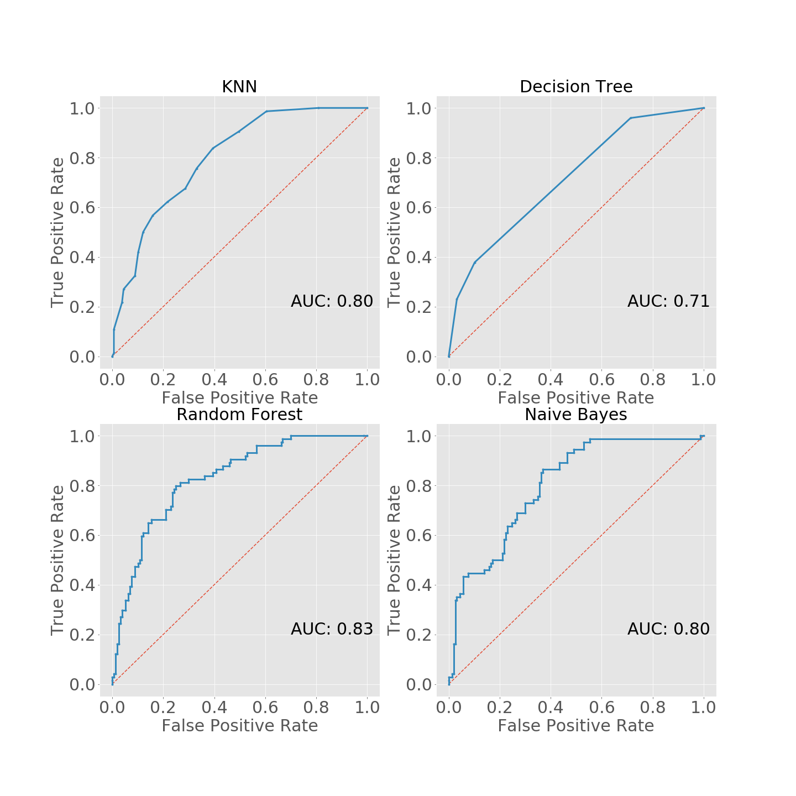

# PIMA-Diabetes-Analysis-

##### This Repository contains all the experimental reports of analyses on PIMA Indian Diabetes dataset. Based on our own analyses, we built machine learning models using different algorithms such as, K-Nearest Neighbor, Decision Tree, Naive Bayes & Random Forest.

## Relations between attributes: (Correlation Matrix)

## Decision Tree:

Decision Tree Hyper-parameter Tuning | Tree Visualization 
:-------------------------:|:-------------------------:
 | 
Max Depth: 2 | Impurity Measurement: Entrophy 
Test Accuracy: 0.7316017316017316 | Train Accuracy: 0.7560521415270018 
Cross Validation Score: 0.7225325884543762 | Accuracy on  Kurmitola Hospital: 0.7955801104972375  

## K-Nearest Neighbor:

#### K-NN accuracy:

Hyper-parameter Tuning

K=16 (best fit)  
Test Accuracy: 0.7575757575757576  
Train Accuracy: 0.7821229050279329  
Cross Validation Score: 0.776536312849162  
Accuracy on  Kurmitola Hospital: 0.8121546961325967  

## Random Forest:

#### Random Forest Accuracy:
'n_estimators': 800,  
'min_samples_split': 10,  
'min_samples_leaf': 4,  
'max_features': 'sqrt',  
'max_depth': 50,  
'bootstrap': True  

Train Accuracy: 0.8845437616387337  
Test Accuracy: 0.7792207792207793  
Accuracy on Kurmitola Hospital: 0.7734806629834254  

## Naive Bayes:

#### Naive Bayes Accuracy:

Train Accuracy: 0.7746741154562383  
Test Accuracy: 0.7229437229437229  
KTH Accuracy: 0.7790055248618785

## Accuracy Comparison:

## Confusion Matrix of classifiers

On PIMA test set | On Kurmitola Hospital Dataset
:-------------------------:|:-------------------------:
 | 

## ROC Curve of classifiers

On PIMA test set | On Kurmitola Hospital Dataset
:-------------------------:|:-------------------------:
 | 
