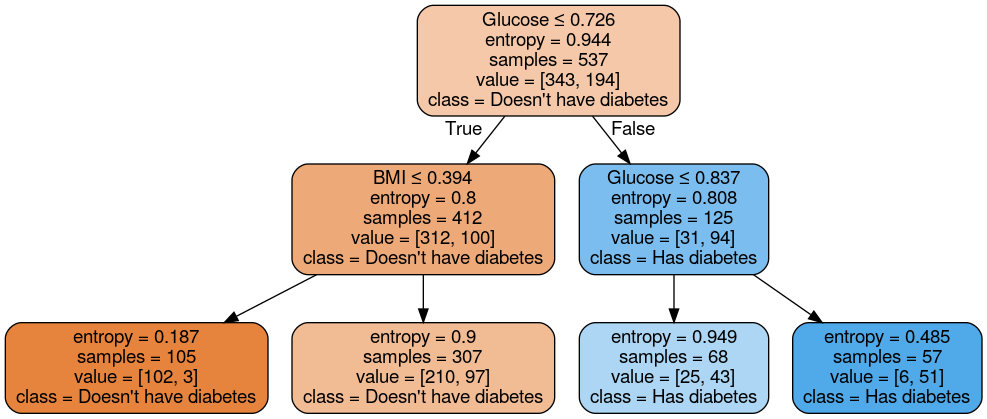

# PIMA-Diabetes-Analysis-

##### This Repository contains all the experimental reports of analyses on PIMA Indian Diabetes dataset. Based on our own analyses, we built machine learning models using different algorithms such as, K-Nearest Neighbor, Decision Tree, Naive Bayes.

## Relations between attributes:
Scatter with all Attributes |  Scatter with most important atrributes
:-------------------------:|:-------------------------:
 |  
## Decision Tree:

Decision Tree Accuracy test by varying tree depth | Tree Visualization 
:-------------------------:|:-------------------------:
 | 
| |Max Depth: 4 
| |Impurity Measurement: Entrophy 
| |Test Accuracy: 0.7705627705627706 
| |Train Accuracy: 0.7746741154562383 
| |Cross Validation Score: 0.7263976240391334

#### Confusion Matrix:

 .| Yes |  No
:--:|:----:|:-----:
 Yes | 118 | 34
 No | 18 | 61

## K-Nearest Neighbor:

#### K-NN accuracy:

Raw Data with all Attributes |  With Our Selected Attributes
:-------------------------:|:-------------------------:
  |  
 | 
| | K=19 (best fit)
| |Test Accuracy: 0.7792207792207793
| |Train Accuracy: 0.7728119180633147
| |Cross Validation Score: 0.7622200263504613

    
#### Confusion Matrix:

 .| Yes |  No
:--:|:----:|:-----:
 Yes | 130 | 22
 No | 29 | 50
 
